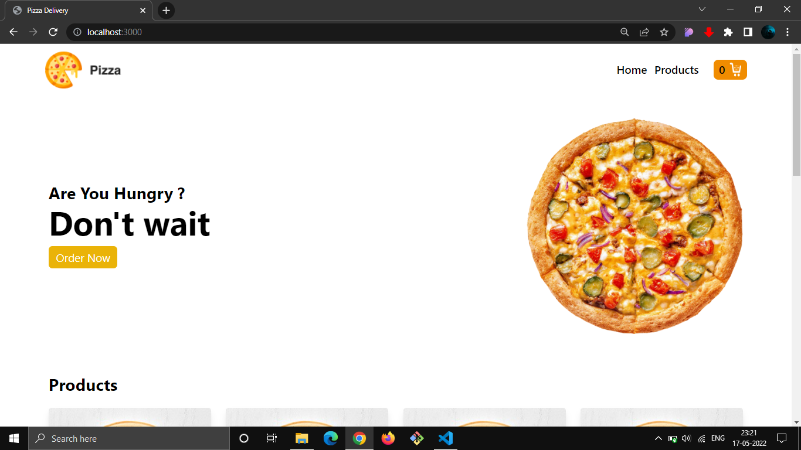

# pizza delivery - webapp

## A front-end pizza delivery webapp

- React js
- React router
- context api

> tailwind css
>
> > used for styling
> > made it responsive for mobile devices

## Features :

- add to cart
- adds items in cart
- after refreshing the page cart is not still having the objects
- cart page showing all added products
- when click increase it increase the count
- when click decrease it will decrease the count
- all the price of the product returning to total price
- clicking delete button removes the product
- clicking the order shows alert and cart get empty

## simple ui

### Checkout preview

[LIVE](https://pizza-delivery-ms.netlify.app/)
